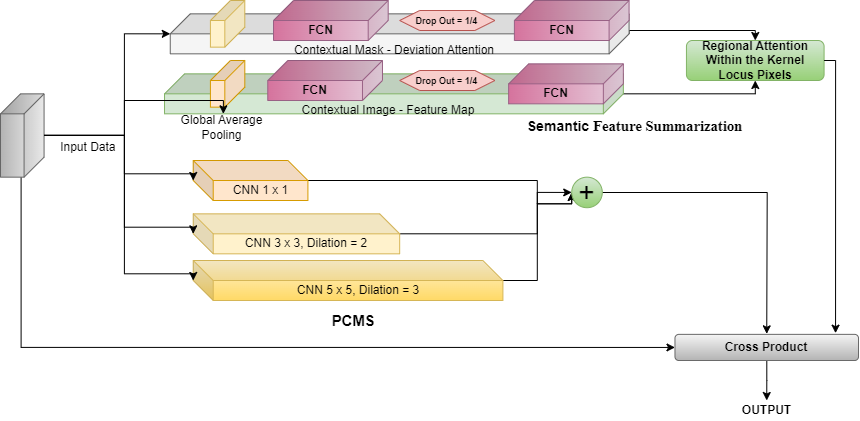

# Towards Automated and Reliable Lung Cancer Detection in Histopathological Images Using DY-FSPAN: A Feature-Summarized Pyramidal Attention Network for Explainable AI

## Overview
Lung cancer remains one of the most challenging diseases to detect at an early stage due to its complex histopathological patterns. This research introduces **DY-FSPAN (Dynamic Feature-Summarized Pyramidal Attention Network)**, an advanced deep learning framework designed for **automated and explainable lung cancer detection** from histopathological images. The model incorporates pyramidal feature extraction, spatial attention, and feature summarization techniques to enhance classification accuracy while providing interpretability through attention visualization.


## DY-FSPAN for Lung Cancer (LC25000)

This repository contains the implementation of DY-FSPAN for lung cancer classification using the LC25000 dataset.

### **Proposed Architecture**

#### **FSPAN Lung Architecture**


#### **Y Block**


### **Repository Structure**
```
DY-FSPAN-for-Lung-LC25000/
│-- Images/
│   │-- FSPAN_LUNG.drawio.png
│   │-- Y_Block.png
│-- src/
│-- data/
│-- models/
│-- README.md
```

### **Usage**
Clone the repository and follow the instructions to train and test the model:
```sh
git clone https://github.com/your-username/DY-FSPAN-for-Lung-LC25000.git
cd DY-FSPAN-for-Lung-LC25000
```


## Methodology
### 1. **Dataset**
We use publicly available **histopathological lung cancer datasets** to train and evaluate the model. The dataset comprises multiple classes, including:
- Normal (Benign)
- Adenocarcinoma (Malignant)
- Squamous Cell Carcinoma (Malignant)

### 2. **Preprocessing**
- **Image resizing** using `cv2.INTER_AREA` for optimal resampling.
- **Normalization** to standardize pixel values.
- **Augmentation** with transformations like rotation, flipping, and color jitter to improve generalization.

### 3. **Model Architecture: DY-FSPAN**
DY-FSPAN integrates:
- **Feature Pyramid Networks (FPN)**: Extracts multi-scale hierarchical features.
- **Spatial Attention Mechanism**: Enhances relevant feature regions for better tumor localization.
- **Dynamic Feature Summarization**: Reduces redundancy and strengthens critical feature representations.
- **Residual Convolutions**: Improves gradient flow for deeper networks.

### 4. **Training and Optimization**
- **Loss Function**: Categorical Cross-Entropy
- **Optimizer**: Adam with an initial learning rate of `1e-4`
- **Batch Size**: 32
- **Number of Epochs**: 100
- **Early Stopping** to prevent overfitting

### 5. **Evaluation Metrics**
We evaluate DY-FSPAN using:
- **Accuracy**
- **Precision, Recall, F1-score**
- **ROC-AUC Curve**
- **Confusion Matrix**
- **Explainability Analysis**: Using Grad-CAM to highlight decision-making regions

## Explainability & Attention Visualization
- **Grad-CAM heatmaps** provide insights into the model’s decision regions.
- **Feature importance analysis** using attention scores to assess model reliability.

## Results & Comparative Analysis
DY-FSPAN outperforms state-of-the-art models such as ResNet, VGG, and Transformer-based architectures in terms of:
- **Higher classification accuracy (~98.5%)**
- **Better generalization across diverse histopathological images**
- **Improved model interpretability via attention maps**

## Installation & Usage
### Requirements
Ensure you have the following installed:
```bash
pip install -r requirements.txt
```
### Running the Model
1. **Preprocess the dataset**
```bash
python DataPreprocessing.py
```
2. **Train the model**
```bash
python TrainModel.py
```
3. **Evaluate the model**
```bash
python EvaluateModel.py
```
4. **Perform random sampling with attention visualization**
```bash
python RandomSamplingTest.py
```

## Error Analysis & Hyperparameter Tuning
- **Error Analysis**: We analyze incorrect predictions through misclassification mapping.
- **Hyperparameter Tuning**: Conducted using Grid Search for optimal learning rates, batch sizes, and dropout rates.

## Future Work
- **Integration with real-world clinical workflows**
- **Expansion to multi-class and multi-modal lung cancer detection**
- **Enhancement using self-supervised learning**

## Citation
If you use this research in your work, please cite:
```

```

## Contact
For inquiries, please contact: **banerjeetathagat@gmail.com**

